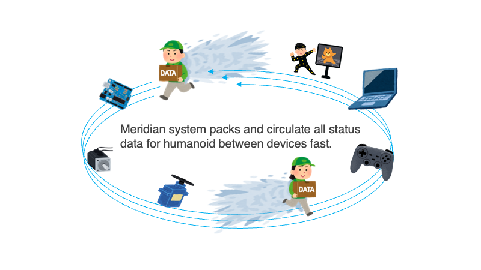
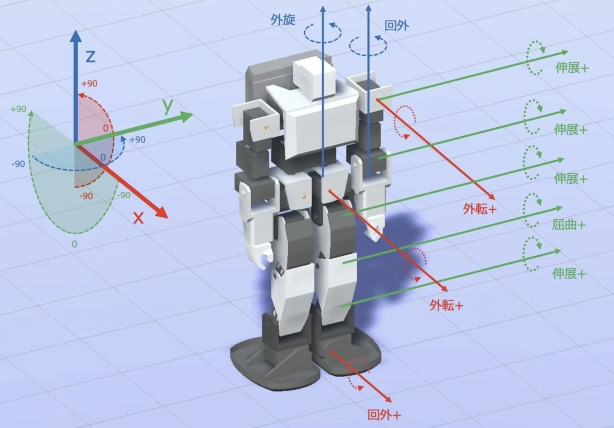
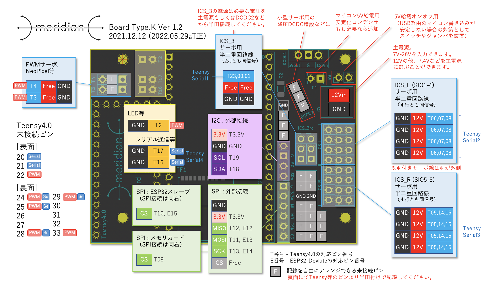
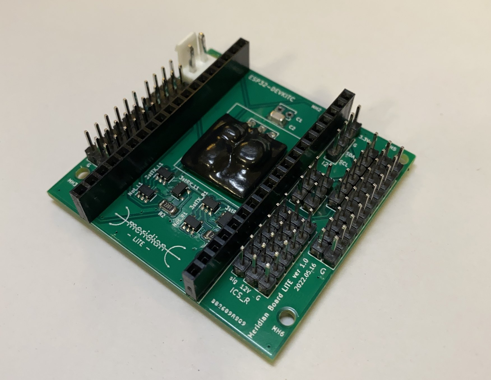
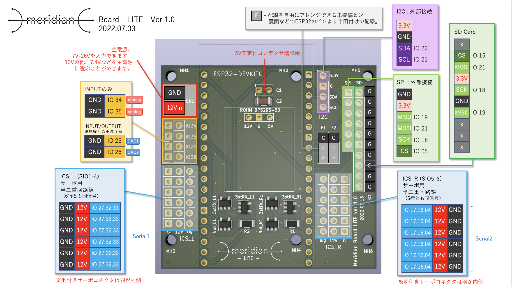
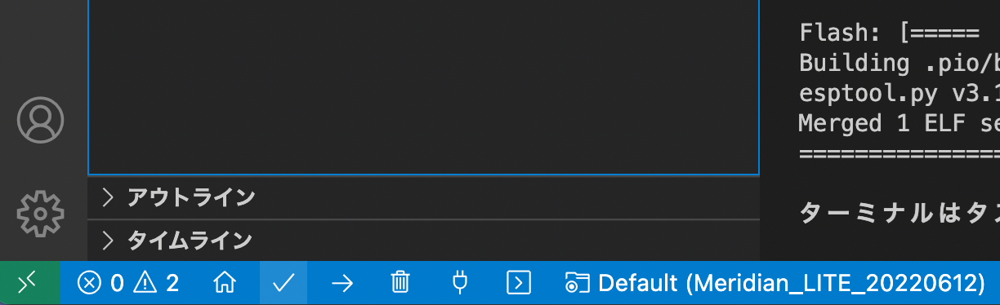
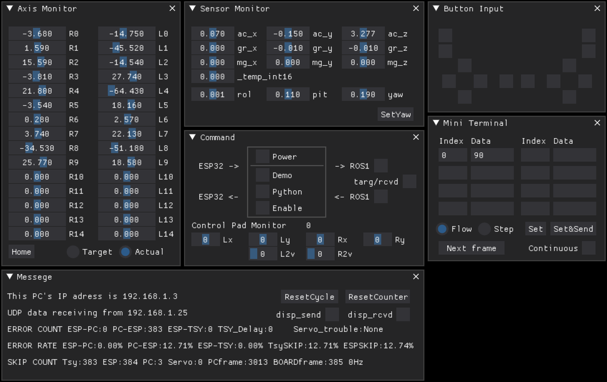
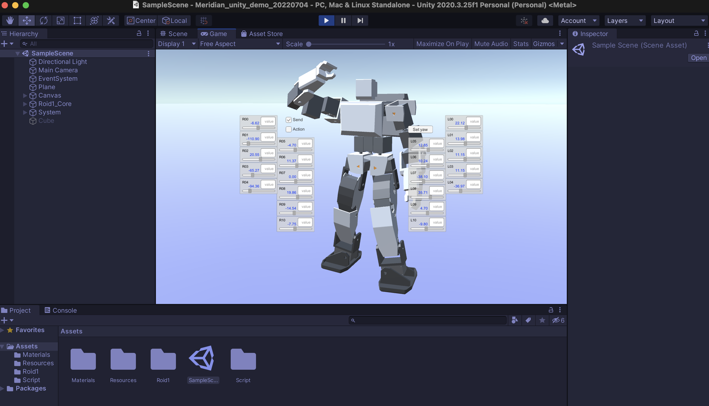
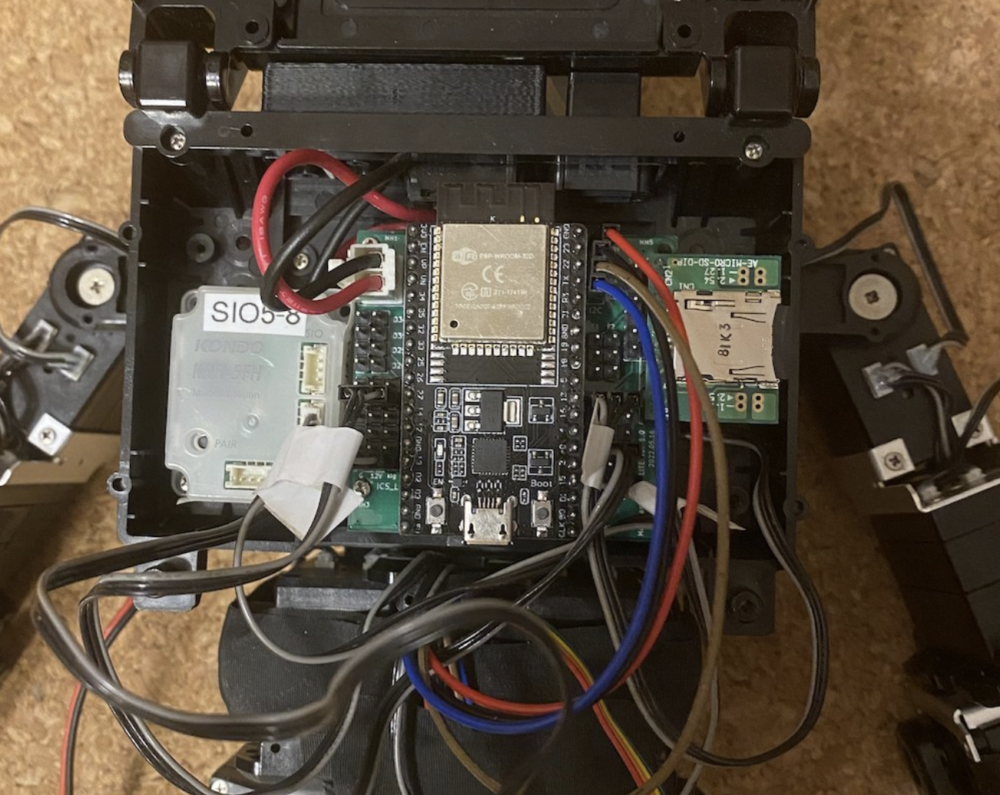

# MeridianFlx


Meridianはヒューマノイドの制御システムについてのオープンソースプロジェクトです.
ホビーロボットのデジタルツイン化を実現し, PC上のシミュレーション空間とロボット実機をWiFi経由で1/100秒(10ms)単位の更新頻度でデータリンクします.



* 100Hzデータリンクのデモ動画
[](https://www.youtube.com/watch?v=4ymSV_Dot-U)

* 100Hzダンスのデモ動画
[](https://www.youtube.com/watch?v=Wfc9j4Pmr3E)

全体の仕組みや開発進捗は[note](https://note.com/ninagawa123/n/ncfde7a6fc835)にまとめています.


## 開発環境

- MeridianFlx
  - ソフトウエア
    - PlatformIO (Teensy4.0のプラットフォームバージョンは3.5.0対応)
    - Teensyduino (Teensy Loader 1.54, PlatformIOと併用)
  - ハードウェア
    - Meridian Twinの場合
      - ボード：Meridian Board Type.K
      - Teensy4.0
      - ESP32DevkitC
    - Meridian Liteの場合
      - ボード：Meridian Board -LITE-
      - ESP32DevkitC
- デバイス（必要に応じて接続してください）
  - センサー
    - MPU6050(GY-521)


少量ですが[booth](https://1985b.booth.pm/)にて完成品ボードの頒布もございます。

Meridianは今後も用途に応じて様々なハードウェア, ソフトウェアに対応させていく予定です.

## インストール方法

リポジトリをクローンしファイルをお手元のPCの適切なディレクトリに展開します.

```bash
git clone --recursive https://github.com/Ninagawa123/meridianflx-dev.git
```

### Meridian Twin

Meridian_TWINは, ハードウェアとして通信用のESP32DevKitC, 制御用のTeensy4.0, それらを連結する専用ボードのMeridian Boardで構成されます.
デモは近藤科学のKRSサーボ(通信速度1.25Mbps)に対応しており, Meridian Board Type.KはKHR-3HV用に搭載することができます.
PC側はROS1のmelodic/noeticに対応しており, 現在Rvizでの表示が可能です. またUnity(Mac/Win版)でもヒューマノイドの姿勢をリアルタイムに反映させることができます.


Teensy4.0, ESP32DevKitCにそれぞれのファイルを書き込みます.
以下の説明の理解にはPlatformIOやTeensy4.0, ESP32の扱いについてのごく初歩的な知識が必要です.

### Teensy4.0の準備

#### PlatformIOでTeensy4.0用のプロジェクトファイルを開く

PlatformIOのファイルメニューより「フォルダーを開く」とし, 先ほど展開したファイルの中から「Meridian_TWIN_for_Teensy40」のディレクトリを選択します.
(Meridian_TWIN_for_ESP32と間違えないようご注意ください.)


#### サーボのマウントを設定する

Teensy4.0用のソースコードの「src/config.h」を開き,183行目ごろから始まるサーボ設定のところで,各サーボのマウントありなしを変更します.
接続しているサーボIDに該当する箇所にサーボタイプの数値を入力します. KHR-3HV標準のKRSサーボの場合は43番です. サーボを接続していない箇所には0を設定します.
サーボのマウント設定により, KHR-3HVのフルセットがなくてもICSサーボが最低１つあればデモをテストすることができます.

#### ロボットの姿勢とサーボを設定する

接続するKRSサーボの通信速度設定をすべて**1.25Mbps**に変更します.

また, サーボの0度状態を下記の姿勢に, サーボの＋回転方向も下図の矢印方向に合わせます.
左半身および体の中心は下図に順次つつ, 右半身については左半身のミラー方向に回転に合わせます.
サーボの回転方向は, サーボの内部の設定変更が望ましいですが, 「src/config.h」でも変更できます.
(ESP32用のファイルにも同名のconfig.hが存在しますのでご注意ください.)


#### サーボを接続する


こちらのピンアサインを参考に, サーボを接続します.

#### センサーを接続する

MPU/AHRSセンサをMeridianボードのI2Cピンに接続します.
今のところキャリブレーション済みのMPU6050(GY-521)のみ対応しています.
センサーがない場合は, Teensy4.0のconfig.hでセンサの接続をオフにすることができます.(#define MOUNT_IMUAHRS NO_IMU)

#### Teensy4.0にソースコードを書き込む

Teensy4.0とPCをUSBケーブルで接続し, PlatformIOの下にある「チェックマーク」のボタンを押して内容をビルドし,[SUCCESS]が表示されることを確認します. その後, 「→」ボタンを押してTeensy4.0にコードを書き込みます.(ボードは自動的に認識されます.)
センサーやリモコンなどの機器の接続について, 「src/config.h」にて詳細を設定できます.

### ESP32DevkitCの準備

#### platformio.ini

platformio.iniでは以下の設定を行なっています.

- platformのバージョン指定
- ESP32内部システムからのエラーコードシリアル出力の抑制
- PCとのSerial通信速度設定を1,000,000に指定
- ライブラリの指定
- OTA（無線経由のプログラム書き込み機能）の無効化によるパーティション拡張

#### 設定の確認

他にも, 接続するリモコンやシリアルモニタなどについての設定が可能です.
Wiiリモコンを接続しない場合は必ず「src/config.h」内のMOUNT_PADをNONEに設定してください.

#### 各種設定の確認

Teensy4.0, ESP32両方の「src/config.h」内のコメントを参考に適宜変更してください.
Teensy4.0は主にサーボやセンサーなどのハードウェア接続の設定や制御システムの基本設定,
ESP32は主に通信系のWifiとBluetoothリモコンの設定になります.

これでMeridian Board側の設定は完了です.


### Meridian Lite



"Meridian board -LITE-" はサーボ制御用の半二重通信回路2系統とSPI,I2Cなどの基本的な入出力ピンを備えたボードです.
搭載するESP32DevkitCはUSBコネクタがMeridian -LITE-のロゴ側を向くように設置してください.

[注意] サーボコネクタを逆やズラして刺すと半二重回路に負荷がかかりボード上のICが一発で壊れるので, 接続は十分ご注意ください.

* ピンアサイン


IOがESP32DevkitCのピン番号に該当しているので, ESP32Devkitのデータシート等を参考に使用することができます.
またSPIやSDカードを使用しない場合は, アサインされたピンをGNDと組み合わせるなどで他の役割を与えることもできます.
Fとなっている箇所は未接続のピンとなっています. 背面で好きな箇所と導線をはんだ付けすることで自由に機能を与えることができます.


#### keys.hの修正

keys.h内の

```cpp
#define AP_SSID "xxxxxx"             // アクセスポイントのAP_SSID
#define AP_PASS "xxxxxx"             // アクセスポイントのパスワード
#define SEND_IP "192.168.1.xx"       // 送り先のPCのIPアドレス（PCのIPアドレスを調べておく）
```

を使用環境に合わせて変更してください.
送り先のPCのIPアドレスは,
windowsならターミナルを開いてipconfigコマンド
ubuntuならip aコマンド
macなら画面右上のwifiアイコンから"ネットワーク"環境設定...
で確認できます.


#### config.hの修正

config.hの内容について, お手持ちの環境にあわせ適度に更新してください.
設定の内容については, コード内にコメントを記しています.
主な修正点は下記の通りです.

```cpp
#define MOUNT_SD  1
→ SDリーダーの搭載 (0:なし, 1:あり)

#define MOUNT_IMUAHRS 1
→ 6軸or9軸センサーの搭載 (0:なし, 1:BNO055, 2:MPU6050(未実装))

// JOYPAD関連設定
#define MOUNT_PAD KRR5FH (KHR-3HV標準のリモコン)
#define MOUNT_PAD WIIMOTE (WIIリモコン, Meridianの通信速度が若干低下します.)

// 各サーボのマウントの設定
サーボを搭載しているIDにメーカーの番号を割り振ります. ※現在は43: KONDOのみ対応

// 各サーボの内外回転プラスマイナス方向補正(1 or -1)
// 各サーボのトリム値(degree)
サーボのトリム値を設定します. ※トリム調整機能は未搭載.
```


#### ビルドとアップロード



画面左下のチェックマークを押すと, ビルドが行われます.
押下して「====== [SUCCESS] Took x.xx seconds」と表示されればビルド成功です.

PCとESP32をUSBケーブルで接続し, 矢印ボタンを押すとESP32の内容が上書きされます.


## 動作確認方法

ボードの準備が整ったら,PCとボードをUSBで接続した状態でボードを起動すると,シリアルモニタに起動時のステータスがメッセージとして表示されます.
PCとの連携にはPC側で[Meridian_console](https://github.com/Ninagawa123/Meridian_console)を立ち上げておくなどの準備が必要になります.

### Meridian consoleを実行する

Meridianで受け取るデータを表示できる[Meridian_console](https://github.com/Ninagawa123/Meridian_console)を用意しました. python3が使える環境で実行可能です.



### Unity版デモを実行する

MeridianとUnityを連携させることができます.
[Meridian_Unity](https://github.com/Ninagawa123/Meridian_Unity)をお試しください.




### ROS版デモを実行する

MeridianとUnityを連携させることができます.
下記のリポジトリより「ROS版デモを実行する」をお試しください.
[https://github.com/Ninagawa123/Meridian_TWIN/edit/main/README.md](https://github.com/Ninagawa123/Meridian_TWIN/edit/main/README.md)


#### ROS noeticの導入

お手持ちの環境にROSを導入してください.
以下の公式のインストール方法をご参照ください.
http://wiki.ros.org/ja/noetic/Installation/Ubuntu

また, Raspberry pi4でROS-noeticを導入する手順については下記にまとめました.
https://qiita.com/Ninagawa_Izumi/items/e84e9841f7a048832fcc


#### URDFの表示テスト

https://github.com/Ninagawa123/roid1
まず, こちらのREADMEにしたがってRvizでロボットを表示できるか確認します.


#### ROS, rviz, meridian_demoを実行する

* roscoreを起動する

```bash
roscore
```

* ランチャーを起動する

```bash
roslaunch roid1_urdf display_meridian_demo.launch
```

*この時点ではロボットはベースとなる腰部分しか表示されません*

Meridian_consoleを起動する

```bash
cd ~/(Meridian_console.pyのあるディレクトリ)
python Meridian_console.py
```

MeridianBoardの電源を入れ接続が確立すると, Meridian consoleの画面のデータが小さく変動し続けます.
ここでMeridian consoleの「->ROS1」にチェックを入れるとロボットRoid.1の姿が現れ,  ロボットのサーボ位置が画面の表示に反映されます.
そのまま（他のチェックボックスが空の状態）で, ロボットのサーボを手で動かした時にロボットにも反映されます.

また, 「DEMO」「Enable」にチェックを入れると, 画面内のロボットがサインカーブで構成されたダンスのデモを行います.
ここでさらに「Power」にもチェックを入れると, ロボットのサーボにパワーが入り, 画面と同じ動きを実機で再現します.


## リモコンの使用方法

### **KRR-5FH/KRC5-FH**

#### KRR-5FH/KRC5-FHの取り付け



KHR-3HVのランドセルに本体無改造で固定することができます.
ランドセル側とボードの間に1~2mm程度のスペーサーが入れるとボード底面の干渉を回避できます.
秋月電子で販売のSDカードホルダ[AE-MICRO-SD-DIP]をSPI端子にそのまま接続することができます. その場合は, SDカードホルダ側にメスのピンヘッダを取り付けてください.
９軸センサについては秋月で販売のBNO055[AE-BNO055-BO]をI2Cに接続することを標準としています.
またリモコン受信機KRR-5FHも内臓できます. 左下のビス穴のみを使いた簡易固定ができます.
蓋もギリギリですが閉じることができます.
Wiiリモコンにも対応しており, すぐに使うことができます.

#### ソフトウェアの改造

config.hの「#define MOUNT_PAD KRR5FH」と設定してボードに書き込みます.
受信機のKRR-5FHはボードの**R系統に接続**します. KRC-5FHのペアリングは製品の説明書の通りです.
受信信号はMeridianに格納されるので, Meridian_console.pyでボタンの受信状況が確認できます.

### **WIIリモコン**

ESP32のBluetooth機能を使って, wiiリモコンおよびヌンチャクを動作させることができます.
ただし, メインの通信に1~5%程度のエラーが発生します.
ESP32のconfig.hで"#define MOUNT_PAD WIIMOTE"と設定してください.
ボード起動時にwiiリモコンの1,2ボタン同時押しでペアリングできます.
Homeボタンはヌンチャクのスティックレバーのキャリブレーションとなります.
(ESP32の23番ピンをLEDアノード用の出力にしてあり, ペアリング中は点滅, ペアリング確立で点灯します.)

#### ソフトウェアの改造

config.hの「#define MOUNT_PAD WIIMOTE」と設定してボードに書き込み, 起動直後にWiiリモコンの1,2ボタンを両押しするとペアリングが確立します.ヌンチャクのレバーも左側のアナログ十字スティックとして機能します.
また、HOMEボタンがアナログスティックのキャリブレーション（リセット）として機能します.

[注意] Meridianの通信速度が若干低下します.


## 参照ライブラリ

本プロジェクトが利用しているライブラリは,[lib/README.md](lib/README.md)を参照してください.

