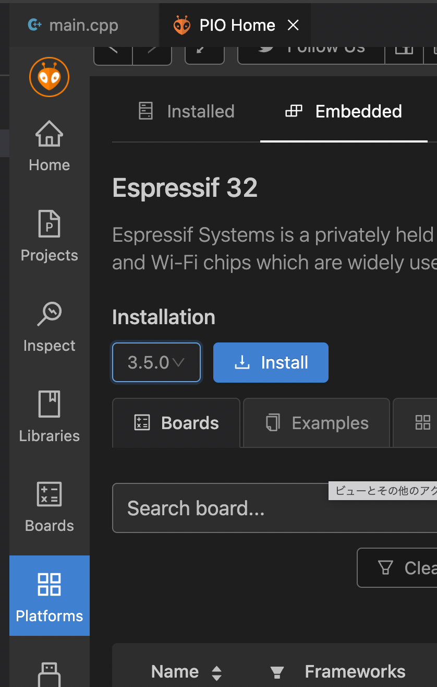

# 開発環境ノウハウ

プログラムのフローや配列の定義, ボードのピンアサインについては[References](../References)ディレクトリの中に資料としてまとめています.
専用ボードの回路図も公開しており, 自作したりブレットボードで再現することが可能です.

システムの中核はMeridimFlx配列というロボットの状態データを格納できるパケットです.
このデータ配列がデバイス間を高速に廻ることで, リアルタイムな状態データの共有を可能にします.
Meridim配列を中間プロトコルとして既存のシステムの間に挟むことで, 複数社のコマンドサーボやセンサ, Unityなどの開発環境などを自由に繋ぐことができ, またROSの入出力にも対応するため, シミュレーターなど多岐にわたるリソースを活用することができます.


## API リファレンス

Meridianの概要やライブラリの関数/変数表など, システムの詳細については以下のサイトを参照してください.
[https://ninagawa123.github.io/Meridian_info/](https://ninagawa123.github.io/Meridian_info/)


## 命名規則

命名規則はLLVM準拠とし, ".clang-format" ファイルに定義しています.
またコードを構成要素ごとにヘッダーファイルで切り分け, モジュール化することで, 改造や拡張の見通しを立ちやすくしました.
フローチャートもDocsにて公開しています.


## 個人情報の保護のための対策

* 問題: Wifiのパスワードなどの個人情報を含むファイルは、リポジトリに含めないようにする必要がありますが、**keys.h**ファイルに記述対応しています。

**keys.hファイルを管理対象から外すため、<font color="Red">下記のコマンドを実行してください。</font>**

<details open>
<summary>gitの管理対象から外すコマンド</summary>

```bash
git update-index --skip-worktree    ./Meridian_LITE_on_Arduino/src/keys.h
git update-index --skip-worktree    ./Meridian_LITE_for_ESP32/src/keys.h
```

</details>

<details>
<summary>gitの管理対象に戻したい場合のコマンド</summary>

```bash
git update-index --no-skip-worktree ./Meridian_LITE_on_Arduino/src/keys.h
git update-index --no-skip-worktree ./Meridian_LITE_for_ESP32/src/keys.h
```

</details>

## 開発環境の構築

### Meridian_console

<details open>
<summary>WindowsのFirewallの設定</summary>

* Windowsで"Meridian_console"を使用する場合、Firewallの設定が必要です。
  1. Windowsの検索バーに「ファイヤーウォールとネットワーク保護」と入力し、ファイアウォールの設定を開きます。
  2. 下側にあるメニューから「詳細設定」をクリックします。
  3. 「受信の規則」
     1. 「受信の規則」をクリックし、右側の「新しい規則」をクリックします。
     2. 「ポート」を選択し、「次へ」をクリックします。
     3. 「UDP」を選択し、「特定のローカルポート」に「40009」を入力し、「次へ」をクリックします。
     4. 「接続の許可する」を選択し、「次へ」をクリックします。
     5. 「ドメイン」「プライベート」「パブリック」の全てにチェックを入れ、「次へ」をクリックします。
     6. 「名前」に「Meridian_40009」を入力し、「完了」をクリックします。
  4. 「送信の規則」
     1. 「送信の規則」をクリックし、右側の「新しい規則」をクリックします。
     2. 「ポート」を選択し、「次へ」をクリックします。
     3. 「UDP」を選択し、「特定のローカルポート」に「40009」を入力し、「次へ」をクリックします。
     4. 「接続の許可する」を選択し、「次へ」をクリックします。
     5. 「ドメイン」「プライベート」「パブリック」の全てにチェックを入れ、「次へ」をクリックします。
     6. 「名前」に「Meridian_40009」を入力し、「完了」をクリックします。

</details>


### PlatformIOの利用のしかた

ご利用の環境にPlatformIOをインストールしてください.

* 参考URL
  * https://qiita.com/JotaroS/items/1930f156aab953194c9a
  * https://platformio.org/

普段Arduino IDEを使っている方のためのPlatformIOの導入Tipsについては下記にまとめました.
[https://qiita.com/Ninagawa_Izumi/items/6f58d9dbfdfe99be9c13](https://qiita.com/Ninagawa_Izumi/items/6f58d9dbfdfe99be9c13)

#### プロジェクトファイルを開く

本リポジトリ直下になるVsCodeのワークスペースファイルを開きます。


「Espressif 32」が見つかるので, バージョン「3.5.0」をインストールします.
新しいバージョン(4.x.x)だとwifi関連がうまく動かない可能性が高いです.

#### Adafruit_BNO055のライブラリを導入する

上記と同様手順で, 「Search libraries」となっている検索枠に「BNO055」と入力し, Adafruit BNO055を選択して「Add to Project」を押します.


#### Meridianのライブラリを導入する

アリ頭のアイコンから「QUICK ACCESS」→「PIO Home」→「Open」を開きます.
右画面PIO Homeのタグの左メニューから「Libraries」を選択します.
「Search libraries」となっている検索枠に「Meridian」と入力し, 「Meridian by Ninagawa123」を選択して「Add to Project」を押します. バージョンは0.1.0以上を使用してください.
次に開くウインドの「Select a project」で今回のプロジェクト（Meridian_LITE_for_ESP32）を選択し, Addボタンを押します.


### platformio.iniの設定

「platformio.ini」を開くと下記のように設定されています.
シリアルモニタのスピードを115200bpsとし, 自動インストールするモジュールを指定しています.
またOTAという無線でのプログラム書き換え機能を削除してメモリ領域を増やす設定にしています.


#### 接続先のPCのIPアドレスを調べる

windowsのコマンドプロンプトを開き,
$ ipconfig （Ubuntuの場合は$ ip a もしくは $ ifconfig）
と入力しコマンド実行します.
IPv4アドレスが表示されます(192.168.1.xxなど)
Macの場合は画面右上のwifiマークから”ネットワーク”環境設定...で表示されます.

#### WIFIを設定する

「src/config.h」 // Wifiアクセスポイントの設定 のところで,
接続したいWIFIのアクセスポイントのSSIDとパスワードを入力します.
アクセスポイントは5GHzではなく**2.4GHz**に対応している必要があります.
また, 先ほど調べた接続先のPCのIPアドレスも記入します.

#### ESP32書き込み用のCP210ドライバを導入する

すでにお手元でESP32 DevkitCに書き込みを行ったことのあるPCであれば問題ないですが,
初めての場合, 「CP210x USB - UART ブリッジ VCP ドライバ」が必要になる場合があります.
未導入の方は下記サイトより適切なものをインストールをしてください.
[https://jp.silabs.com/developers/usb-to-uart-bridge-vcp-drivers?tab=downloads](https://jp.silabs.com/developers/usb-to-uart-bridge-vcp-drivers?tab=downloads
)

#### ESP32にソースコードを書き込む

ここで一度, 更新したファイルを**セーブしESP32に書き込みます**.
ESP32とPCをUSBケーブルで接続し, PlatformIOの下にある「チェックマーク」のボタンを押して内容をビルドし,[SUCCESS]が表示されることを確認します. その後, 「→」ボタンを押してESP32にコードを書き込みます.(ボードは自動的に認識されます.)

#### ESP32のIPアドレスを調べる

PlatformIOで画面下のコンセントアイコンからシリアルモニタを開き, ESP32DevKitC本体のENボタンを押します.
wifi接続に成功すると

> Hi, This is Meridian_TWIN_for_ESP32_vX.X.X_20XX.XX.XX
> Set PC-USB 1000000 bps
> Set SPI0   6000000 bps
> WiFi connecting to => xxxxxxx
> WiFi successfully connected.
> PC's IP address target => 192.168.1.xxx
> ESP32's IP address => 192.168.1.xxx
>
> -) Meridian TWIN system on side ESP32 now flows. (-

と表示され, 「ESP32's IP address =>」にESP32本体のIPアドレスが表示されます.この番号をメモしておきます.
